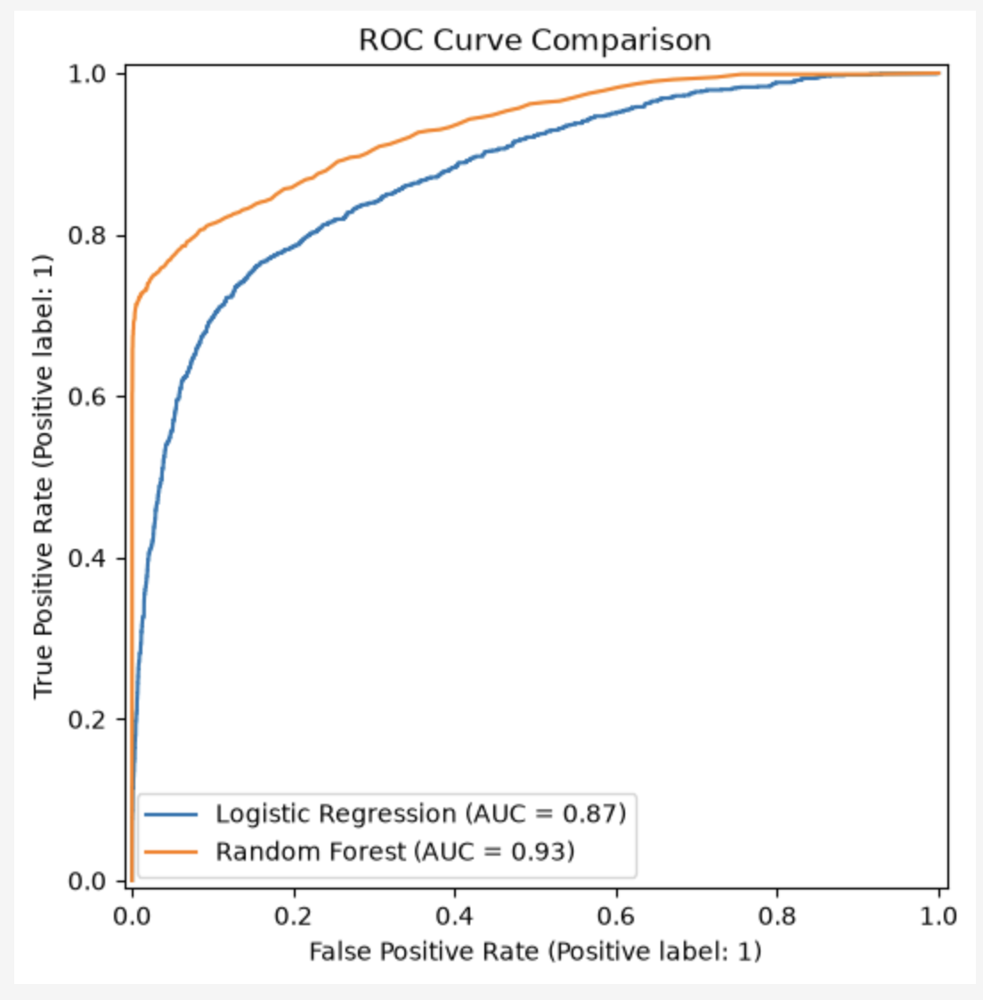
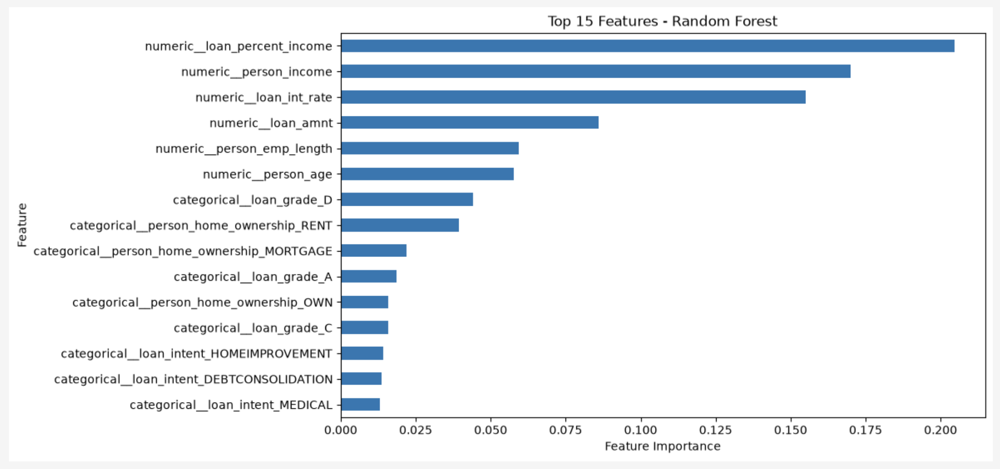

# Credit Risk Prediction

Can machine learning identify applicants who are at greater risk of defaulting on a loan?

This project profiles the `credit_risk_dataset.csv` dataset, addresses data-quality issues, and explores patterns associated with loan default before modelling. Logistic Regression and Random Forest classifiers are trained and compared using accuracy, precision, recall, F1-score and ROC-AUC, alongside confusion matrices, ROC curves and feature-importance analysis. Results are interpreted from a credit-risk perspective, weighing missed defaults against false risk flags. A thoroughly validated model could support risk assessment and ranking rather than act as an automated lending decision-maker.

## Business problem

Lenders lose money when they approve borrowers who later default, and they lose revenue when they reject borrowers who would have repaid. A data-driven default-risk score can sit alongside existing credit processes to help rank applicants, set review queues, and make the cost of those two error types more explicit. This analysis aims to identify higher-risk borrowers while remaining cautious about incorrectly flagging people who would successfully repay.

## Contents

- [How to run](#how-to-run)
- [Dataset](#dataset)
- [Methodology](#methodology)
- [Results](#results)
- [Key findings](#key-findings)
- [Business implications](#business-implications)
- [Ethical considerations](#ethical-considerations)
- [Technologies](#technologies)
- [Future improvements](#future-improvements)

## How to run

Workflows are documented for a local machine or a cloud notebook (for example Google Colab).

**Prerequisites:** Python 3.10 or newer.

1. Clone or download this repository.
2. Create a virtual environment (recommended) and install dependencies:

```bash
python -m venv .venv
source .venv/bin/activate   # Windows: .venv\Scripts\activate
pip install -r requirements.txt
```

3. Open `main.ipynb` in Jupyter, VS Code, or Colab and run the cells in order.

The notebook reads `data/credit_risk_dataset.csv`. A cleaned copy is also saved at `data/credit_risk_dataset_cleaned.csv`.

## Dataset

The data is the public [Credit Risk Dataset](https://www.kaggle.com/datasets/laotse/credit-risk-dataset) from Kaggle (originally ~32,581 loan applications). Each row is an applicant/loan profile. The target is `loan_status`:

| Value | Meaning |
| --- | --- |
| `0` | Loan repaid |
| `1` | Loan defaulted |

About **21.8%** of loans in the sample defaulted, so the target is imbalanced but still usable with class weighting and a stratified train/test split.

**Features include:**

- Applicant: age, income, home ownership, employment length
- Loan: intent, grade, amount, interest rate, loan-to-income ratio
- Credit bureau: prior default on file, credit history length

## Methodology

1. **Data cleaning**
   - Drop 165 duplicate rows. Impute missing employment length with the global median (~2.7% missing) and missing interest rate with the median by `loan_grade` (~9.6% missing).
   - Cap extreme ages and incomes so implausible outliers do not dominate the fit.
2. **Exploratory analysis** 
    - Inspect class balance, default rates by grade, home ownership and loan intent, and correlations with the target.
3. **Feature preparation** 
    - Drop `cb_person_cred_hist_length` because it is nearly redundant with age and weaker against the target.
    - Scale numeric features and one-hot encode categoricals. 
    - Stratified 80/20 train/test split.
4. **Logistic regression**
    - Interpretable baseline with `class_weight="balanced"`.
5. **Random forest**
    - 200 trees with balanced class weights, to capture non-linear relationships and feature interactions.
6. **Evaluation** 
    - Accuracy, precision, recall, F1, ROC-AUC, confusion matrices, ROC curves, and Random Forest feature importance.

`loan_grade` and `loan_int_rate` are treated as a leakage risk: grades and rates are often assigned by an existing credit process, so a model that uses them may partly reconstruct that process rather than learn independent signal.

## Results



At the default 0.50 classification threshold, Random Forest outperformed Logistic Regression on accuracy, precision, F1 and ROC-AUC. Logistic Regression achieved slightly higher recall, so it caught a larger share of actual defaults.

| Model | Recall | ROC-AUC |
| --- | ---: | ---: |
| Logistic Regression | 0.774 | 0.87 |
| Random Forest | 0.744 | 0.93 |

Random Forest test-set confusion matrix: 4,838 true non-defaults, 1,032 true defaults, **109 false positives**, and **356 false negatives** (accuracy 0.927, precision 0.904, F1 0.816).

The Random Forest is conservative at 0.50: when it flags a default, it is usually right, but it still misses more than three times as many defaults as it raises false alarms.

## Key findings

- Default is strongly associated with higher **loan-to-income ratio** and higher **interest rate**; income is only modestly protective, and raw loan amount matters less than size relative to income.
- **Renters** default more often than mortgage-holders or outright owners. **Debt-consolidation** and **medical** loans default somewhat more than venture or education loans.
- Default rates rise sharply with worse **loan grades**, which is expected and is also a reminder that grade (and rate) may leak prior underwriting decisions.
- The most important Random Forest features are loan-to-income ratio, income, interest rate and loan amount; financial characteristics of the borrower and the loan, not demographic proxies on their own.



## Business implications

For a bank, these models are better framed as **risk-ranking tools** than as automatic approve/decline engines.

- High precision (Random Forest) means flagged applications are relatively trustworthy candidates for extra review or tighter terms.
- Missed defaults (false negatives) are still the larger error. If the cost of a default is much higher than the cost of extra scrutiny, the classification threshold should be lowered so more potential defaults are caught, accepting more false positives.
- Predicted default **probabilities** are more useful operationally than a hard 0/1 label, because different products and risk appetites can use different cut-offs.

## Ethical considerations

Credit models can encode historical bias if past lending, recovery, or data collection treated groups unequally. This dataset does not include protected characteristics such as race or gender, but proxies (income, home ownership, employment length) can still correlate with them.

Limitations that matter for fairness and deployment:

- The sample is a single public dataset, not a live book of business.
- Including `loan_grade` / `loan_int_rate` can recycle an existing (and possibly biased) decision system.
- Feature importance is not causation; correlated variables share credit for predictions.
- A model that is accurate overall can still be unfair for subgroups. Any production use would need explainability, disparate-impact testing, human review, and monitoring over time.

## Technologies

Python, Pandas, NumPy, scikit-learn, Matplotlib, Seaborn, Jupyter.

## Future improvements

- Hyperparameter tuning and k-fold cross-validation (instead of a single split)
- Threshold selection against an explicit cost of false negatives vs false positives
- Investigate and possibly exclude leakage from `loan_grade` / `loan_int_rate`
- Explainable AI (for example SHAP) and subgroup fairness analysis
- Larger or more recent data, and monitoring if the model were deployed
